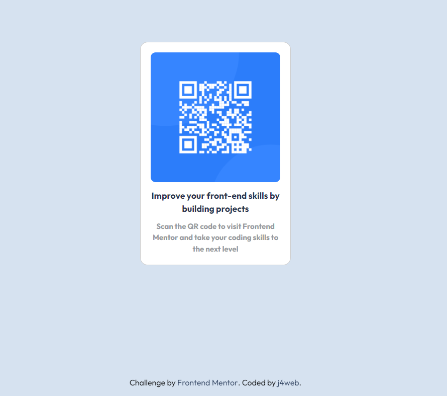

# Frontend Mentor - QR code component solution

  

This is a solution to the [QR code component challenge on Frontend Mentor](https://www.frontendmentor.io/challenges/qr-code-component-iux_sIO_H). Frontend Mentor challenges help you improve your coding skills by building realistic projects.

  

## Table of contents

  

- [Overview](#overview)

- [Screenshot](#screenshot)

- [Links](#links)

- [My process](#my-process)

- [Built with](#built-with)

- [Useful resources](#useful-resources)

- [Author](#author)
  

 

## Overview

  

### Screenshot

  Here is the final result of the challenge - 

  

### Links

  

- Solution URL: [Add solution URL here]([J4Web/FrontendMentor-Qr-Challenge: Frontend Mentor QR code component challenge. (github.com)](https://github.com/J4Web/FrontendMentor-Qr-Challenge))

- Live Site URL: [Add live site URL here](https://your-live-site-url.com)

  

## My process

- I started by using a mobile-first approach for designing the web page. This means that I focused on creating the layout and content specifically for smaller screens like mobile phones. By starting with mobile, I ensured that the page would be functional and user-friendly on smaller devices.

- To enhance the typography of the page, I used Google Fonts. Google Fonts provides a wide range of fonts that can be easily integrated into a web project. I selected a suitable font from the Google Fonts library and included it in my project. This helped improve the overall appearance and readability of the text on the page.

- By adopting a mobile-first approach and utilizing Google Fonts, I was able to create a well-designed and visually appealing web page that is optimized for mobile devices and provides an excellent user experience.

  

### Built with

- Semantic HTML5 markup

- CSS custom properties

- Flexbox

- CSS Grid

- Mobile-first workflow

### Useful resources

  

- [StackEdit](https://stackedit.io/app#) - This helped me for writing README of my project. I really like this because of how it makes the whole process of handling the README of the project so well.

- [Google Fonts](https://fonts.google.com/) - This is the place where you can get any fonts you want!

- [Color-Picker](https://imagecolorpicker.com/) - This is the place you can just upload a picture in and just get the color of the text its THAT easy!
  

## Author

  

- Website - [j4web](https://www.your-site.com)

- Frontend Mentor - [@j4web](https://www.frontendmentor.io/profile/yourusername)

- Twitter - [@j4web31](https://www.twitter.com/j4web31)
